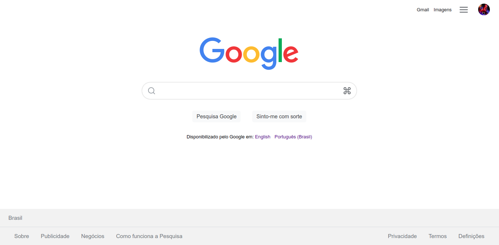

# Tela de pesquisa do Google

Tela feita para aprender mais sobre React e como utilizar seus elementos.

[Site](https://kaio-matos.github.io/frontend-google-search/build/index.html)

## Tela

### Tecnologias usadas:

- React JS

[Meu Linkedin](https://www.linkedin.com/in/kaio-matos-9532271a5)
